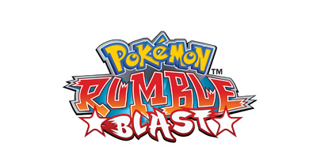

<p align="center">
  
</p>

# Pokémon Rumble Blast — Shiny Mod

A ROM mod that adds a full **Shiny Pokémon system** to Pokémon Rumble Blast (3DS), a feature that never existed in the original game.

## Features

- **Shiny Pokémon spawns** — Random chance for any wild Pokémon to spawn as shiny
- **Configurable shiny rate** — Default 1/512, adjustable via command line (1/256, 1/1024, 1/4096, etc.)
- **Shiny 3D models** — Alternate color variants load automatically for shiny Pokémon
- **Shiny face icons** — Collection and UI screens display shiny-specific icons
- **Shiny star indicator** — Shiny Pokémon are marked with a colored star in the collection grid
- **Shiny name color** — Shiny Pokémon names appear in a distinct color on the field
- **Guaranteed catch** — Shiny Pokémon have a 100% befriend rate
- **Shiny death drops** — Defeating a shiny Pokémon drops a shiny toy via the existing drop system
- **Save persistence** — Shiny status is preserved across save/load cycles

## Requirements

- **Python 3.12+**
- **HackingToolkit9DS** — For extracting and repacking the ROM
  - Download & tutorial: https://www.gamebrew.org/wiki/HackingToolkit9DS_3DS
- A **US encrypted copy** of Pokémon Rumble Blast (.3ds / .cia)
  - Dump from your own 3DS, or obtain a US encrypted copy
- **Batch CIA 3DS Decryptor** — For decrypting the repacked ROM
  - Download: https://gbatemp.net/threads/batch-cia-3ds-decryptor-a-simple-batch-file-to-decrypt-cia-3ds.512385/
- **Citra** or **Azahar** emulator to play the patched ROM

## Installation

### 1. Extract the ROM

Open HackingToolkit9DS and extract your US encrypted Pokémon Rumble Blast ROM. This will produce a folder structure containing `ExtractedExeFS/` and `ExtractedRomFS/`.

### 2. Patch code.bin

Run the patcher, pointing it at the extracted `code.bin`:

```
python patch.py path/to/ExtractedExeFS/code.bin
```

To set a custom shiny rate (default is 1/512):

```
python patch.py path/to/ExtractedExeFS/code.bin --rate 1/4096
```

### 3. Install shiny assets

Copy the shiny model, icon, and UI assets into the extracted RomFS:

```
python copy_assets.py path/to/ExtractedRomFS
```

### 4. Repack the ROM

Use HackingToolkit9DS to repack the modified files back into a `.3ds` or `.cia` file.

### 5. Decrypt for emulator use

Run **Batch CIA 3DS Decryptor** on the repacked ROM to produce a decrypted file that can be loaded in an emulator.

### 6. Play

Open the decrypted ROM in **Citra** or **Azahar** and enjoy shiny hunting!

### Alternative: Play on 3DS hardware

Instead of decrypting for an emulator, you can use HackingToolkit9DS to build a `.cia` file and install it directly on a modded 3DS via FBI. This method is **untested** — use at your own risk.

## Known Issues

- **Shiny model not loaded on initial spawn** — When entering a level with a shiny Pokémon as your active character, the normal model loads initially. Switching to another Pokémon and back resolves it.
- **Collection 3D model** — Shiny Pokémon in the collection detail screen (top screen) may display the normal model instead of the shiny variant. The shiny star indicator still appears correctly.
- **Limited shiny models** — Only Pokémon with manually created shiny texture variants will display alternate colors. Others will appear normal even if flagged as shiny.

## Project Status

This mod is in its current release state. Development may be revisited at a later point.

## Shiny Rate Reference

| Rate    | Odds      |
|---------|-----------|
| `1/2`   | 50%       |
| `1/16`  | 6.25%     |
| `1/256` | 0.39%     |
| `1/512` | 0.20% *(default)* |
| `1/1024`| 0.10%     |
| `1/4096`| 0.024%    |

Non-power-of-2 values are rounded to the nearest power of 2.
